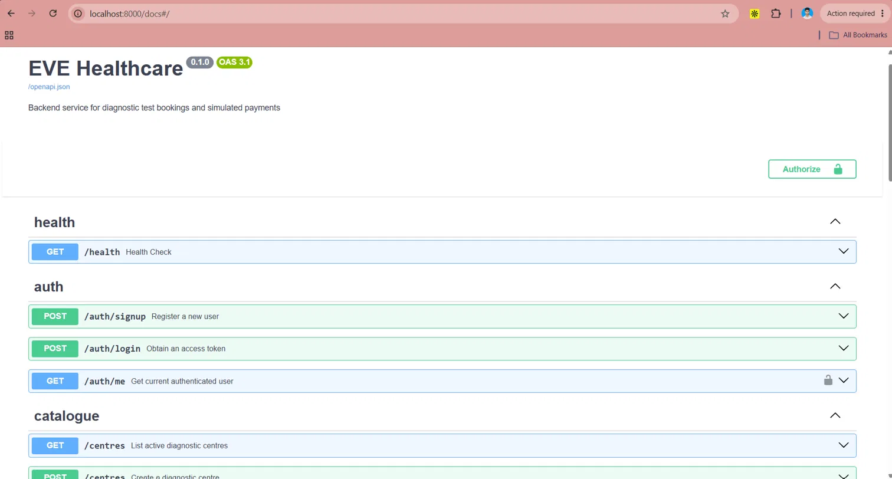
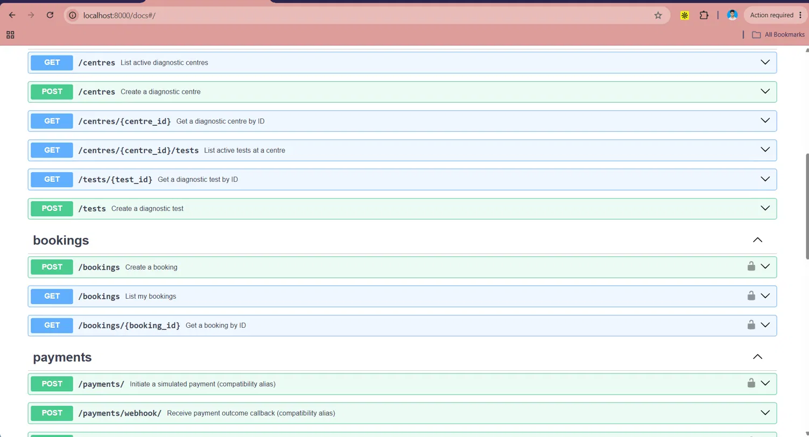
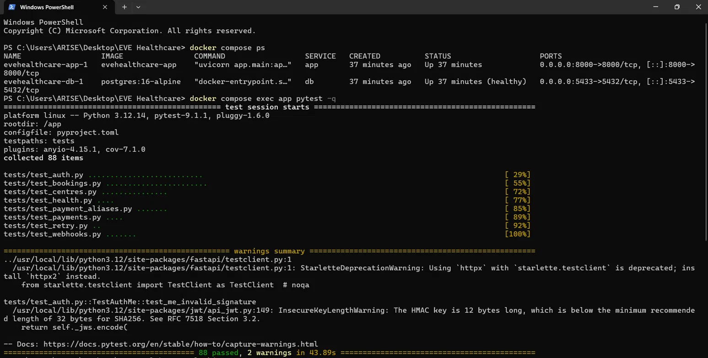

<div align="center">
  <h1>🏥 EVE Healthcare Backend</h1>
  <p><strong>A robust, secure, and highly-scalable backend service for diagnostic test bookings and simulated payments.</strong></p>
  
  [](https://www.python.org)
  [](https://fastapi.tiangolo.com)
  [](https://www.postgresql.org)
  [](https://www.docker.com)
  []()
</div>

---

## 📖 Overview

Welcome to the **EVE Healthcare Backend**! This API powers diagnostic centres, allowing patients to seamlessly book appointments and process payments asynchronously. It is built strictly in Python with a focus on engineering excellence, security, and idempotency.

> **Current Scope:** All project phases are complete! Features include Foundation, Authentication, Diagnostics & Bookings, Simulated Payments & Webhooks, and Rate Limiting & Retry Handling.

---

## 📸 Project Showcase

### Interactive API Documentation (Swagger UI)


### Comprehensive Endpoints


### 100% Test Coverage & Dockerized Environment


> **Note:** To display the images above, please create an `assets` folder in the root directory and save your provided screenshots as `swagger1.png`, `swagger2.png`, and `tests.png` respectively!

---

## ✨ Key Features

- **🔐 User Management:** Secure user signup and login utilizing JWT authentication and bcrypt password hashing.
- **🏥 Diagnostic Catalogue:** Browse diagnostic centres and their associated tests with built-in pagination.
- **📅 Bookings:** Authenticated users can reserve exact time slots for diagnostic tests.
- **💳 Simulated Payments:** Background tasks simulate real-world payment gateway latency and an 80% success rate.
- **🛡️ Idempotent Webhooks:** Gateway callbacks are rigorously validated via **HMAC SHA256** and applied exactly once using database-level `SELECT ... FOR UPDATE` row locks to prevent race conditions.
- **🚦 Rate Limiting:** Protects sensitive `/auth` endpoints with strict in-memory sliding windows (`slowapi`), scaling globally for all other routes.
- **🔄 Retry Mechanisms:** Transient network errors during asynchronous webhook dispatch are intelligently retried via `tenacity` with exponential backoff.
- **⚙️ Engineering Quality:** Fully Dockerized, robust structured JSON logging (`structlog`), OpenAPI auto-docs, rigorous data validation (Pydantic), and extensive integration testing.

---

## 🚀 Quick Start

### 🐳 Using Docker Compose (Recommended)

Get the entire stack up and running in seconds:

```bash
# Start the application and database in the background
docker compose up -d

# Run database migrations
docker compose exec app alembic upgrade head
```
The API is now live at: `http://localhost:8000`

### 💻 Local Development

```bash
# 1. Create and activate a virtual environment
python -m venv .venv
source .venv/bin/activate  # Mac/Linux
# .venv\Scripts\activate   # Windows

# 2. Install dependencies
pip install -e ".[dev]"

# 3. Setup environment configuration
cp .env.example .env

# 4. Start PostgreSQL (Make sure Docker is running)
docker compose up db -d

# 5. Run database migrations
alembic upgrade head

# 6. Start the development server
uvicorn app.main:app --reload
```

---

## 📚 API Documentation

Once the server is running, explore the interactive documentation:
- **Swagger UI:** [http://localhost:8000/docs](http://localhost:8000/docs)
- **ReDoc:** [http://localhost:8000/redoc](http://localhost:8000/redoc)

---

## 🛤️ Core API Endpoints

### 🔐 Authentication
| Method | Endpoint | Description |
|--------|----------|-------------|
| `POST` | `/auth/signup` | Register a new user |
| `POST` | `/auth/login` | Obtain a JWT access token |
| `GET` | `/auth/me` | Get current user profile (Protected) |

### 🏥 Catalogue & Bookings
| Method | Endpoint | Description |
|--------|----------|-------------|
| `GET` | `/centres` | List active diagnostic centres |
| `GET` | `/centres/{id}/tests` | List tests for a centre |
| `POST` | `/bookings` | Book an appointment (Protected) |

<details>
<summary><b>Click to see an example Booking request</b></summary>

```http
POST /bookings
Authorization: Bearer <token>
Content-Type: application/json

{
  "centre_id": "uuid-here",
  "test_id": "uuid-here",
  "appointment_date": "2026-12-01",
  "appointment_time": "10:00:00"
}
```
</details>

### 💳 Payments & Webhooks
| Method | Endpoint | Description |
|--------|----------|-------------|
| `POST` | `/bookings/{id}/pay` | Initiate simulated payment (Protected) |
| `POST` | `/payments/` | Alias for payment initiation |
| `POST` | `/webhooks/payments` | Gateway callback (HMAC Protected) |
| `POST` | `/payments/webhook/` | Alias for webhook callback |

---

## 🏗️ Database Schema Design

The backend is powered by **PostgreSQL**, strictly managed by **SQLAlchemy** and **Alembic**.

- **Users:** Central identity table storing hashed credentials.
- **DiagnosticCentres:** Physical locations offering tests.
- **DiagnosticTests:** The test catalogue, enforcing a `Decimal` price type to prevent floating-point inaccuracies.
- **Bookings:** The joining entity associating a User, Centre, and Test. Price is snapshotted at the time of booking!
- **Payments:** Tracks transaction attempts (`PENDING`, `SUCCESS`, `FAILED`). State transitions are exclusively driven by secure Webhooks.

---

## 🔒 Security & Architecture Highlights

- **Absolute Idempotency:** Webhook payloads process serially via Postgres Row-Level Locks, guaranteeing that race conditions can never double-confirm a single payment.
- **HMAC Signatures:** Payment callbacks mandate an `X-Webhook-Signature` matching a locally signed hash of the raw payload *before* JSON parsing, eliminating malicious impersonation and malformed JSON crash attacks.
- **Boundary Isolation (IDOR Prevention):** Users can never query or mutate another user's Bookings or Payments. Protections are built natively into foundational SQLAlchemy queries (`.filter(user_id=current_user.id)`).
- **In-Memory Rate Limiting:** Bounded locally to memory to satisfy architectural constraints (can be scaled via Redis in a production cluster).

---

## 🧪 Testing

The repository boasts an exhaustive **88-test suite** covering rate-limits, idempotency, retries, and core logic. Run it locally via:

```bash
pytest
```
*(All 88 tests pass successfully with isolation via SQLite savepoints).*
