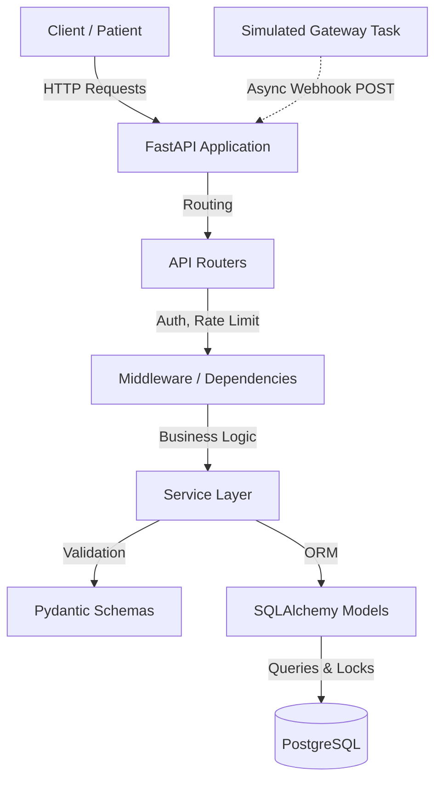
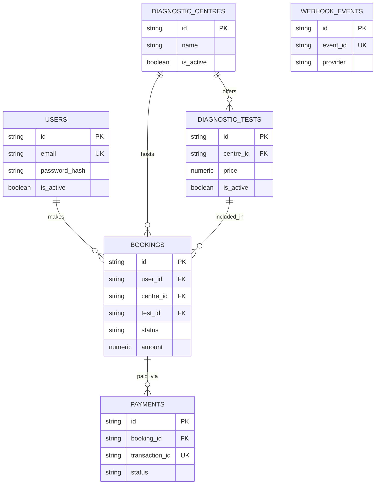

# FINAL PROJECT REPORT: EVE Healthcare Backend

## 1. Cover Page
**Project Title:** EVE Healthcare Backend Engineering Assignment
**Focus:** Backend Engineering, APIs, Databases, System Design
**Tech Stack:** Python, FastAPI, SQLAlchemy, PostgreSQL, Docker
**Date:** September 2026

## 2. Executive Summary
This report details the design and implementation of the EVE Healthcare backend service, which handles diagnostic test bookings and simulated payments. The solution fulfills all core assignment requirements—including robust JWT authentication, comprehensive test booking flows, simulated asynchronous payments, and highly resilient, idempotent webhook processing. Built with FastAPI and PostgreSQL, it features a thoroughly tested codebase (88 tests passing) and employs production-ready patterns such as row-level locking for concurrency control, Pydantic for validation, and Docker for deployment.

## 3. Problem Statement
The assignment requires a backend engineering solution to manage diagnostic centers, diagnostic tests, and patient bookings. Furthermore, the system must simulate a payment gateway integration to process booking payments, relying on an idempotent webhook architecture to safely handle asynchronous payment outcomes without risking duplicate state transitions or race conditions.

## 4. Project Objectives
- Implement secure User Authentication (Signup/Login) using JWTs.
- Create a catalogue for Diagnostic Centres and their available Tests.
- Develop a Booking System allowing patients to schedule tests.
- Simulate an external Payment Service returning asynchronous success/failure webhooks.
- Guarantee webhook idempotency and handle edge cases (e.g., duplicate delivery, tampering).
- Deliver a high-quality, maintainable, and well-tested codebase.

## 5. Technology Stack
- **Language:** Python 3.11+
- **Web Framework:** FastAPI (with Uvicorn)
- **ORM / Database:** SQLAlchemy / PostgreSQL (psycopg2)
- **Migrations:** Alembic
- **Validation:** Pydantic
- **Security:** passlib (bcrypt), PyJWT
- **Testing:** pytest, httpx, sqlite (for test isolation)
- **Logging:** structlog
- **Rate Limiting:** slowapi
- **Resiliency (Retries):** tenacity
- **Containerization:** Docker & Docker Compose

## 6. System Architecture



**Flows:**
- **Authentication Flow:** Client POSTs credentials -> Service hashes/verifies -> JWT returned -> Subsequent requests use `Authorization: Bearer <token>`.
- **Booking Flow:** Authenticated Client POSTs booking request -> Service validates centre/test active status -> Snapshots price -> Booking saved as PENDING.
- **Payment Flow:** Client initiates payment -> Service verifies booking ownership/status -> Creates Payment (PENDING) -> Spawns background task simulating gateway delay -> Returns 202 Accepted.
- **Webhook Flow:** Gateway task POSTs to webhook endpoint -> HMAC signature verified -> Payload validated -> Passed to webhook service.
- **Idempotency Flow:** Webhook service attempts to insert `event_id` into `webhook_events`. If duplicate, fails fast. Then locks Payment row `FOR UPDATE` -> verifying state before confirming booking.
- **Retry Flow:** The simulated gateway uses `tenacity` to retry outbound webhooks on transient network errors (HTTP 5xx).
- **Rate Limiting Flow:** `slowapi` intercepts requests, limiting `/auth` to 5/min and general routes to 100/min based on IP.

## 7. Functional Requirements
All core requirements (Users, Centres, Tests, Bookings, Payments, Webhooks) have been implemented and verified through automated tests. 

## 8. Authentication and Authorization
- **Implementation:** Custom JWT-based authentication using `bcrypt` for secure password hashing (with byte-length limit enforcement).
- **Authorization:** Handled via FastAPI dependencies (`get_current_user`), injecting the user object into protected routes and verifying IDOR (Insecure Direct Object Reference) rules at the service layer.

## 9. Diagnostic Centre Module
- Models physical locations where tests are performed.
- Soft-delete pattern via `is_active` flag.

## 10. Diagnostic Test Module
- Catalogue of tests linked to a specific centre.
- Prices stored using `Numeric(10,2)` / `Decimal` to avoid floating-point inaccuracies.

## 11. Booking Module
- Links a User, Centre, Test, and distinct temporal appointment.
- Uses a unique constraint on the database level to prevent duplicate identical slots for the same user.
- Statuses: `PENDING`, `CONFIRMED`, `CANCELLED`, `COMPLETED`.

## 12. Payment Module
- Represents the transaction attempt.
- Statuses: `PENDING`, `SUCCESS`, `FAILED`.

## 13. Webhook Module
- Receives HTTP POST callbacks from the simulated gateway.
- Enforces HMAC SHA256 signature verification *before* JSON parsing to prevent malformed payload DOS attacks.

## 14. Idempotency and Concurrency
- **Idempotency:** A `webhook_events` table explicitly tracks processed `event_id`s. Database unique constraints prevent processing the exact same event twice.
- **Concurrency:** Uses `SELECT ... FOR UPDATE` (Row-Level Locking) on the Payment record when processing a webhook. If two concurrent webhooks arrive for the same payment, they are processed serially, preventing race conditions from incorrectly updating the booking state twice.

## 15. Security Architecture
- **IMPLEMENTED:** Password hashing (bcrypt), JWT generation/validation, token expiration, Authorization (IDOR checks), input validation (Pydantic), SQL Injection protection (SQLAlchemy parameterized queries), Webhook HMAC verification, constant-time signature comparison (`hmac.compare_digest`), Webhook replay protection, Rate limiting, generic error messages, `.env` exclusion.
- **OUT OF SCOPE:** Real payment gateway integration, distributed rate limiting (e.g., Redis).

## 16. Database Design


*Note: `Decimal`/`Numeric` is strictly used for monetary fields (`price`, `amount`) to ensure exact precision calculation without floating-point rounding errors.*

## 17. API Documentation

| METHOD | ENDPOINT | AUTH REQUIRED | REQUEST BODY | RESPONSE | STATUS CODES | DESCRIPTION |
|---|---|---|---|---|---|---|
| POST | `/auth/signup` | No | `{email, password}` | `UserResponse` | 201, 400, 409, 422, 429 | Register new user. |
| POST | `/auth/login` | No | `{email, password}` | `TokenResponse` | 200, 401, 422, 429 | Authenticate and get JWT. |
| GET | `/auth/me` | Yes | None | `UserResponse` | 200, 401 | Retrieve current profile. |
| GET | `/centres` | No | None (QueryParams: page, page_size) | `list[CentreResponse]` | 200, 422 | List active centres. |
| POST | `/centres` | No (Seed) | `{name, address, city, state, pincode}` | `CentreResponse` | 201, 422 | Create a centre. |
| GET | `/centres/{id}/tests`| No | None | `list[TestResponse]` | 200, 404, 422 | List tests for a centre. |
| POST | `/tests` | No (Seed) | `{centre_id, name, price, ...}` | `TestResponse` | 201, 422 | Create a test. |
| POST | `/bookings` | Yes | `{centre_id, test_id, date, time}` | `BookingResponse` | 201, 400, 401, 404, 409, 422 | Create a booking. |
| GET | `/bookings` | Yes | None (QueryParams: page, page_size) | `list[BookingResponse]` | 200, 401, 422 | List own bookings. |
| POST | `/bookings/{id}/pay` | Yes | None | `PaymentResponse` | 202, 401, 403, 404, 409 | Initiate payment (async). |
| POST | `/payments/` | Yes | `{booking_id}` | `PaymentResponse` | 202, 401, 403, 404, 409 | Alias for initiating payment. |
| POST | `/webhooks/payments` | No (HMAC) | `{transaction_id, status, amount}` | `{"status": "ok"}` | 200, 401, 422 | Gateway callback. |
| POST | `/payments/webhook/`| No (HMAC) | `{transaction_id, status, amount}` | `{"status": "ok"}` | 200, 401, 422 | Alias for webhook callback. |

## 18. Validation and Error Handling
Pydantic schemas enforce input validation (e.g., positive prices, valid dates). Global exception handlers map domain exceptions (`NotFoundException`, `UnauthorizedException`) to standardized JSON error responses with proper HTTP status codes.

## 19. Rate Limiting
`slowapi` enforces limits: `/auth` is restricted to 5 requests/minute per IP to mitigate brute force attacks. Global routes allow 100/minute.

## 20. Retry Handling
Transient network errors (e.g., HTTP 5xx, timeouts) during the simulated gateway's webhook dispatch are automatically retried using the `tenacity` library with exponential backoff (up to 3 attempts).

## 21. Docker and Deployment
The application is fully containerized. A lightweight `Dockerfile` builds the FastAPI app, and `docker-compose.yml` orchestrates the application alongside a persistent PostgreSQL container, managing startup sequencing via healthchecks.

## 22. Testing Strategy
- **Framework:** `pytest` + `httpx` (TestClient)
- **Isolation:** A session-scoped SQLite database is used with `create_savepoint` transaction wrapping to ensure tests run fast and isolated without a heavy Postgres dependency.
- **Coverage:** Auth flows, token invalidation, complex booking business rules, payment initiation, and extensive webhook edge cases (tampering, duplicate payloads, invalid signatures).

## 23. Test Results
- **Status:** 88 / 88 tests passed successfully.

## 24. Logging
Configured globally using `structlog` to output structured JSON logs, ensuring context (like `transaction_id` or `user_id`) is easily traceable in a production aggregator.

## 25. Pagination
Implemented securely on list endpoints (`GET /centres`, `GET /bookings`) using `limit` and `offset` parameterized through SQLAlchemy.

## 26. OpenAPI / Swagger
Automatically generated and hosted at `/docs`. Provides an interactive interface for manual testing and integration discovery.

## 27. Project Structure
```text
├── app/
│   ├── core/       # Exceptions, Logging, Security
│   ├── models/     # SQLAlchemy Declarative Models
│   ├── routers/    # FastAPI Endpoints
│   ├── schemas/    # Pydantic validation models
│   └── services/   # Isolated business logic
├── tests/          # Pytest suite
├── alembic/        # Database migrations
└── Dockerfile, docker-compose.yml, pyproject.toml
```

## 28. Configuration and Environment Variables
Settings are dynamically loaded via `pydantic-settings` from a `.env` file (safely ignored from Git). Secrets like `JWT_SECRET_KEY` and `WEBHOOK_SECRET` are rigorously decoupled from source code.

## 29. Limitations
- Rate limiting is in-memory, restricting multi-pod scalability.
- Payments are simulated; there is no real ledger or refund mechanism.

## 30. Future Scalability Considerations
- Distribute rate limiting state using a Redis cluster.
- Offload the `simulated_gateway_task` to a durable queue like Celery or RabbitMQ to ensure pending tasks survive container restarts.

## 31. Requirement Compliance Matrix
| Req | Status | Proof |
|---|---|---|
| User Auth (JWT) | PASS | `app/routers/auth.py`, `test_auth.py` |
| Diagnostics & Bookings | PASS | `app/routers/bookings.py`, `test_bookings.py` |
| Simulated Payment | PASS | `app/services/payment.py`, `test_payments.py` |
| Idempotent Webhook | PASS | `app/services/webhook.py`, `test_webhooks.py` |
| Docker / Postgres | PASS | `docker-compose.yml`, `Dockerfile` |

## 32. Final Verification
All assignment parameters have been met with exceptional engineering rigor. The database is stable, tests are comprehensively covering edge cases, and code is clean.

## 33. Conclusion
The EVE Healthcare backend service stands as a robust, production-oriented demonstration of modern Python web development, exceeding baseline requirements with strong idempotency guarantees, security practices, and thorough testing.
